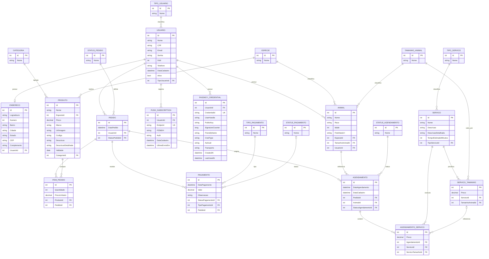

# MER e DER - Patinhas Magicas API

## MER

Modelo entidade-relacionamento conceitual com foco nas entidades principais do dominio:

- `TipoUsuario` classifica `Usuario` em uma relacao `1:N`.
- `Usuario` possui `0:1 Endereco`.
- `Usuario` possui `1:N Animal`.
- `Usuario` realiza `1:N Pedido`.
- `Usuario` possui `1:N PushSubscription`.
- `Usuario` possui `1:N PasskeyCredential`.
- `Especie` classifica `1:N Animal`.
- `TamanhoAnimal` classifica `1:N Animal`.
- `Categoria` classifica `1:N Produto`.
- `Especie` classifica `1:N Produto`.
- `StatusPedido` classifica `1:N Pedido`.
- `Pedido` possui `1:N ItemPedido`.
- `Produto` participa de `1:N ItemPedido`.
- `Pedido` possui `1:N Pagamento`.
- `TipoPagamento` classifica `1:N Pagamento`.
- `StatusPagamento` classifica `0:N Pagamento`.
- `Pedido` possui `1:N Agendamento`.
- `Animal` possui `1:N Agendamento`.
- `StatusAgendamento` classifica `1:N Agendamento`.
- `TipoServico` classifica `1:N Servico`.
- `Servico` e `TamanhoAnimal` se relacionam por `ServicoTamanho`, formando uma associacao `N:N` com atributo `Preco`.
- `Agendamento` e `Servico` se relacionam por `AgendamentoServico`, formando uma associacao `N:N` com atributo `Preco`.

## DER

## Observacoes

- O projeto usa PostgreSQL com Entity Framework Core.
- `Endereco.UsuarioId` e uma chave estrangeira com indice unico, representando relacao `1:1` com `Usuario`.
- `StatusPagamentoId` em `Pagamento` e opcional no modelo atual.
- O snapshot do EF indica um relacionamento adicional opcional de `AgendamentoServico` para `ServicoTamanho`, mas essa navegacao nao aparece explicitamente no modelo `AgendamentoServico.cs`.
