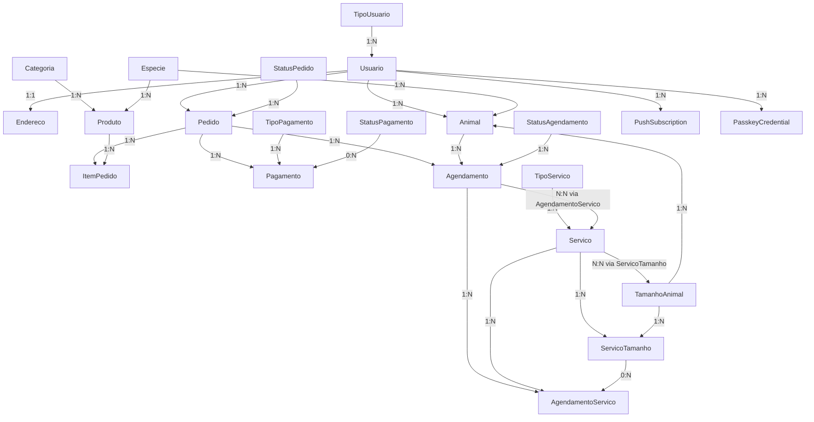

# MER em Mermaid - Patinhas Magicas API

```mermaid
flowchart TD
    TipoUsuario[TipoUsuario]
    Usuario[Usuario]
    Endereco[Endereco]
    Animal[Animal]
    Especie[Especie]
    TamanhoAnimal[TamanhoAnimal]
    Pedido[Pedido]
    StatusPedido[StatusPedido]
    ItemPedido[ItemPedido]
    Produto[Produto]
    Categoria[Categoria]
    Pagamento[Pagamento]
    TipoPagamento[TipoPagamento]
    StatusPagamento[StatusPagamento]
    Agendamento[Agendamento]
    StatusAgendamento[StatusAgendamento]
    Servico[Servico]
    TipoServico[TipoServico]
    ServicoTamanho[ServicoTamanho]
    AgendamentoServico[AgendamentoServico]
    PushSubscription[PushSubscription]
    PasskeyCredential[PasskeyCredential]

    TipoUsuario -->|1:N| Usuario
    Usuario -->|1:1| Endereco
    Usuario -->|1:N| Animal
    Usuario -->|1:N| Pedido
    Usuario -->|1:N| PushSubscription
    Usuario -->|1:N| PasskeyCredential

    Especie -->|1:N| Animal
    TamanhoAnimal -->|1:N| Animal

    Categoria -->|1:N| Produto
    Especie -->|1:N| Produto

    StatusPedido -->|1:N| Pedido
    Pedido -->|1:N| ItemPedido
    Produto -->|1:N| ItemPedido

    Pedido -->|1:N| Pagamento
    TipoPagamento -->|1:N| Pagamento
    StatusPagamento -->|0:N| Pagamento

    Pedido -->|1:N| Agendamento
    Animal -->|1:N| Agendamento
    StatusAgendamento -->|1:N| Agendamento

    TipoServico -->|1:N| Servico
    Servico -->|N:N via ServicoTamanho| TamanhoAnimal
    Servico -->|1:N| ServicoTamanho
    TamanhoAnimal -->|1:N| ServicoTamanho

    Agendamento -->|N:N via AgendamentoServico| Servico
    Agendamento -->|1:N| AgendamentoServico
    Servico -->|1:N| AgendamentoServico
    ServicoTamanho -->|0:N| AgendamentoServico
```
